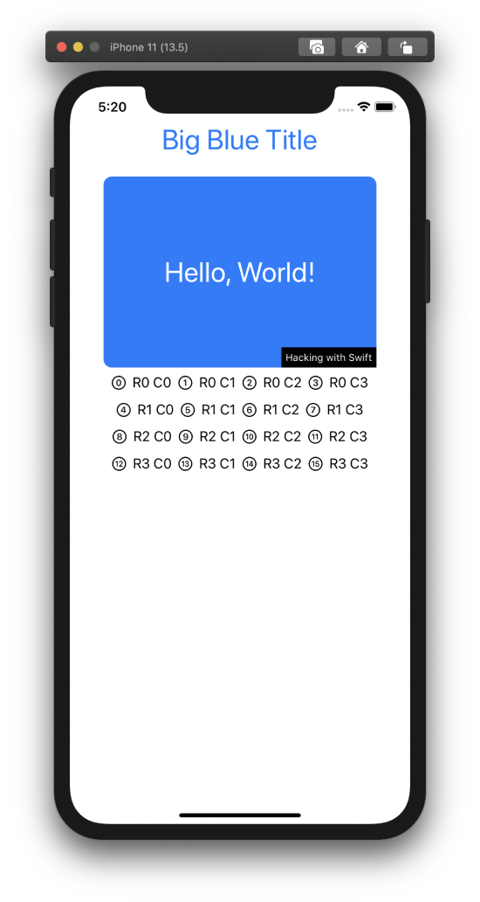

# Project 3: Views&Modifiers +

https://www.hackingwithswift.com/100/swiftui/23

Includes solutions to the [challenges](https://www.hackingwithswift.com/books/ios-swiftui/views-and-modifiers-wrap-up).

## Topics

Views, modifiers, composition, containers

## Challenges

From [Hacking with Swift](https://www.hackingwithswift.com/books/ios-swiftui/views-and-modifiers-wrap-up):
>1. Create a custom ViewModifier (and accompanying View extension) that makes a view have a large, blue font suitable for prominent titles in a view.
>2. Go back to project 1 and use a conditional modifier to change the total amount text view to red if the user selects a 0% tip.
>3. Go back to project 2 and create a FlagImage() view that renders one flag image using the specific set of modifiers we had.

## Screenshots

